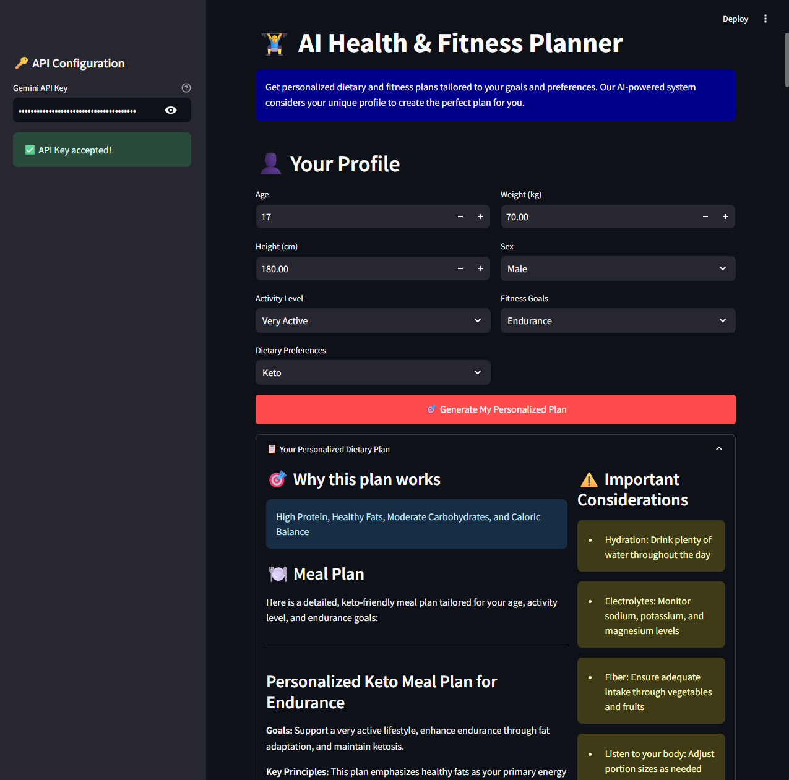

# 🏋️‍♂️ AI Health & Fitness Planner

> Personalized dietary and fitness plans powered by Google Gemini AI and built with Streamlit

Transform your health journey with AI-generated, personalized meal plans and workout routines tailored to your unique profile, goals, and preferences.


## ✨ Features

- 🎯 **Personalized Dietary Plans** - Custom meal plans based on your dietary preferences (Vegetarian, Keto, Gluten-Free, Low Carb, Dairy-Free)
- 💪 **Custom Fitness Routines** - Tailored workout plans aligned with your fitness goals (Weight Loss, Muscle Gain, Endurance, Strength Training)
- 🤖 **AI-Powered Recommendations** - Leverages Google Gemini 2.5 Flash for intelligent, context-aware suggestions
- 📄 **Export to Markdown** - Save your plans as timestamped markdown files for offline reference
- 💬 **Interactive Q&A** - Ask questions about your plans and get instant AI-powered answers
- 🎨 **Clean, Intuitive UI** - Modern Streamlit interface with responsive design

## 📁 Project Structure

```
health-fitness-agent/
│
├── 📄 health_agent.py          # Main Streamlit application
├── 📄 requirements.txt         # Python dependencies
├── 📄 README.md               # Project documentation
├── 📄 LICENSE                 # MIT license file
├── 📁 .health-agent/          # Python virtual environment
│   ├── 📄 .gitignore
│   ├── 📄 .lock
│   ├── 📄 CACHEDIR.TAG
│   └── 📄 pyvenv.cfg
├── 📁 reports/                # Generated plan exports
│   ├── 📄 dietary_plan_*.md   # Individual dietary plans
│   ├── 📄 fitness_plan_*.md   # Individual fitness plans
│   └── 📄 combined_plan_*.md   # Complete health plans
└── 📁 screenshots/            # Application interface screenshots
    └── 📄 app-main-interface.png
```

## ✨ Key Features

### 🤖 Dual AI Agent System
- **🍽️ Dietary Expert Agent**: Specialized in nutrition science and meal planning
- **💪 Fitness Expert Agent**: Expert in exercise physiology and workout design
- **🔄 Interactive Q&A**: Ask questions about your plans and get instant answers

### 🍎 Personalized Dietary Plans
- **📋 Detailed Meal Plans**: Breakfast, lunch, dinner, and snack recommendations
- **🎯 Goal-Oriented Nutrition**: Calorie-conscious plans aligned with your objectives
- **🥗 Dietary Flexibility**: Support for Keto, Vegetarian, Gluten-Free, Low-Carb, and more
- **💧 Health Considerations**: Hydration, electrolyte balance, and fiber intake guidance
- **📊 Nutritional Analysis**: Macronutrient breakdowns and meal timing strategies

### 🏋️‍♀️ Customized Fitness Programs
- **🎯 Goal-Specific Training**: Weight loss, muscle gain, endurance, or general fitness
- **🔥 Complete Workouts**: Warm-up, main exercises, and cool-down routines
- **📈 Progressive Overload**: Structured progression for continuous improvement
- **💡 Expert Tips**: Form guidance, recovery advice, and motivation strategies
- **📅 Flexible Scheduling**: Adaptable to your lifestyle and time constraints

### 📄 Export & Sharing
- **💾 Markdown Export**: Save plans as beautifully formatted documents
- **📊 Progress Tracking**: Monitor your journey with detailed reports
- **🔄 Plan Updates**: Easily regenerate plans as your goals evolve

## 🛠️ Technology Stack

| Technology        | Purpose                   | Version   |
| ----------------- | ------------------------- | --------- |
| **Python**        | Core programming language | 3.8+      |
| **Streamlit**     | Web application framework | 1.40.2    |
| **Agno AI**       | Multi-agent framework     | Latest    |
| **Google Gemini** | AI model provider         | 2.5 Flash |
| **Markdown**      | Export format             | -         |

## 🚀 Quick Start

### Prerequisites
- **Python 3.8** or higher
- **Gemini API Key** (free from Google AI Studio)

### Installation

1. **Clone the repository**
   ```bash
   git clone https://github.com/EloiRamos/health-fitness-planner.git
   cd health-fitness-planner
   ```

2. **Set up virtual environment** (recommended)
   ```bash
   python -m venv venv
   source venv/bin/activate  # On Windows: venv\Scripts\activate
   ```

3. **Install dependencies**
   ```bash
   pip install -r requirements.txt
   ```

4. **Get your Gemini API Key**
   - Visit [Google AI Studio](https://aistudio.google.com/apikey)
   - Create a free account and generate an API key

5. **Launch the application**
   ```bash
   streamlit run health_agent.py
   ```

6. **Open your browser**
   - Navigate to `http://localhost:8501`
   - Enter your Gemini API key in the sidebar

## 📖 Usage Guide

### Step 1: Profile Setup
Fill out your personal information:
- **Basic Info**: Age, weight, height, sex
- **Activity Level**: Sedentary to extremely active
- **Dietary Preferences**: Keto, vegetarian, gluten-free, etc.
- **Fitness Goals**: Weight loss, muscle gain, endurance, etc.

### Step 2: AI Plan Generation
- Click **"🎯 Generate My Personalized Plan"**
- Watch as our AI agents create your custom plans
- Review your personalized dietary and fitness recommendations

### Step 3: Plan Interaction
- **Explore Your Plans**: Detailed meal plans and workout routines
- **Ask Questions**: Use the Q&A section for clarification
- **Export Plans**: Save as markdown files for offline reference

### Step 4: Track Progress
- Follow your plans consistently
- Export updated plans as your goals evolve
- Use the Q&A feature for ongoing support

## 🔑 API Configuration

### Gemini API Setup
1. Visit [Google AI Studio](https://aistudio.google.com/apikey)
2. Sign in with your Google account
3. Click "Create API key"
4. Copy the generated key
5. Paste it into the application sidebar

**Note**: The API key is only stored locally in your session and is not transmitted to any external servers.

## 📋 Sample Output

Here's an excerpt from a typical combined health plan:

```markdown
# Complete Health & Fitness Plan Report

**Generated on:** 2025-10-20 12:03:47

## User Profile
**Age:** 17 | **Weight:** 70.0kg | **Height:** 170.0cm
**Activity Level:** Very Active | **Dietary Preferences:** Keto
**Fitness Goals:** Strength Training

## 🍽️ Dietary Plan
### Why This Plan Works
High Protein, Healthy Fats, Moderate Carbohydrates, and Caloric Balance

### Meal Plan
**Breakfast (600-700 calories)**
- 4 Large Eggs scrambled with 2 tbsp Heavy Cream
- 3 slices Thick-Cut Bacon
- 1/2 Avocado, sliced
- 1 cup Sautéed Spinach

## 💪 Fitness Plan
### Goals
Build strength, improve endurance, and maintain overall fitness

### Exercise Routine
**Warm-Up (5-10 minutes)**
- Jumping Jacks (30 seconds)
- Arm Circles (10 forward, 10 backward)
- Leg Swings (10 each direction)

**Main Workout**
- Barbell Back Squat (3-4 sets, 5-8 reps)
- Barbell Bench Press (3-4 sets, 5-8 reps)
- Conventional Deadlift (3-4 sets, 3-6 reps)
```

## 📸 Application Screenshot

Here's how the AI Health & Fitness Planner looks in action:



*The application provides an intuitive interface for generating personalized health and fitness plans with AI-powered recommendations.*

### Development Guidelines
- Follow PEP 8 style guidelines
- Add tests for new features
- Update documentation as needed
- Ensure all tests pass before submitting PR

## 📝 License

This project is licensed under the MIT License - see the [LICENSE](LICENSE) file for details.

## 🙏 Acknowledgments

- Built with [Streamlit](https://streamlit.io/)
- Powered by [Google Gemini AI](https://ai.google.dev/)
- Agent framework by [Agno](https://github.com/agno-agi/agno)

## ⚠️ Disclaimer

This application provides general health and fitness information for educational purposes only. Always consult with qualified healthcare professionals before starting any new diet or exercise program.

---

